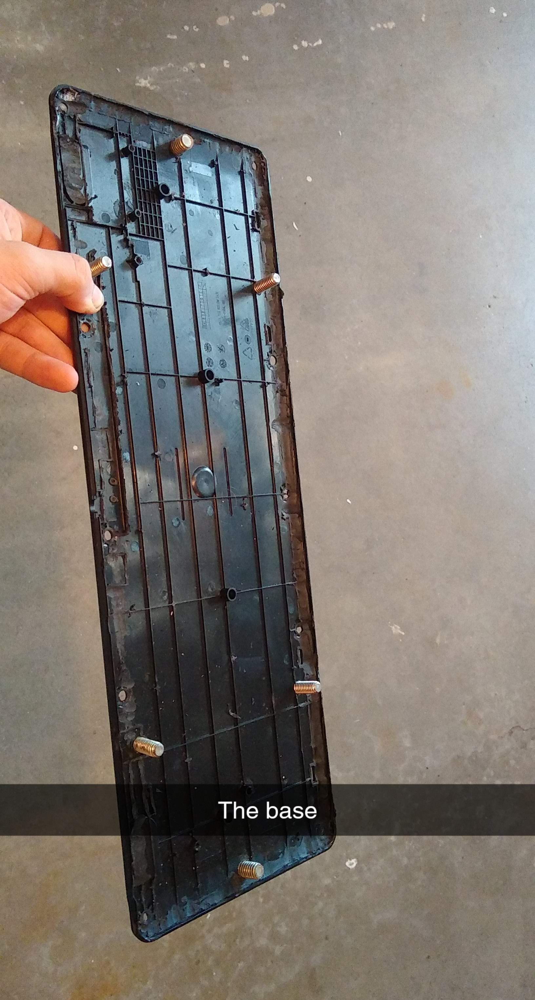
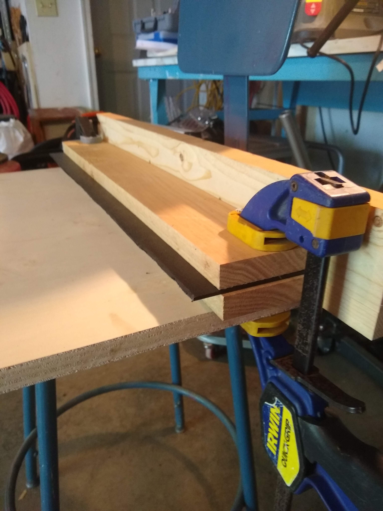
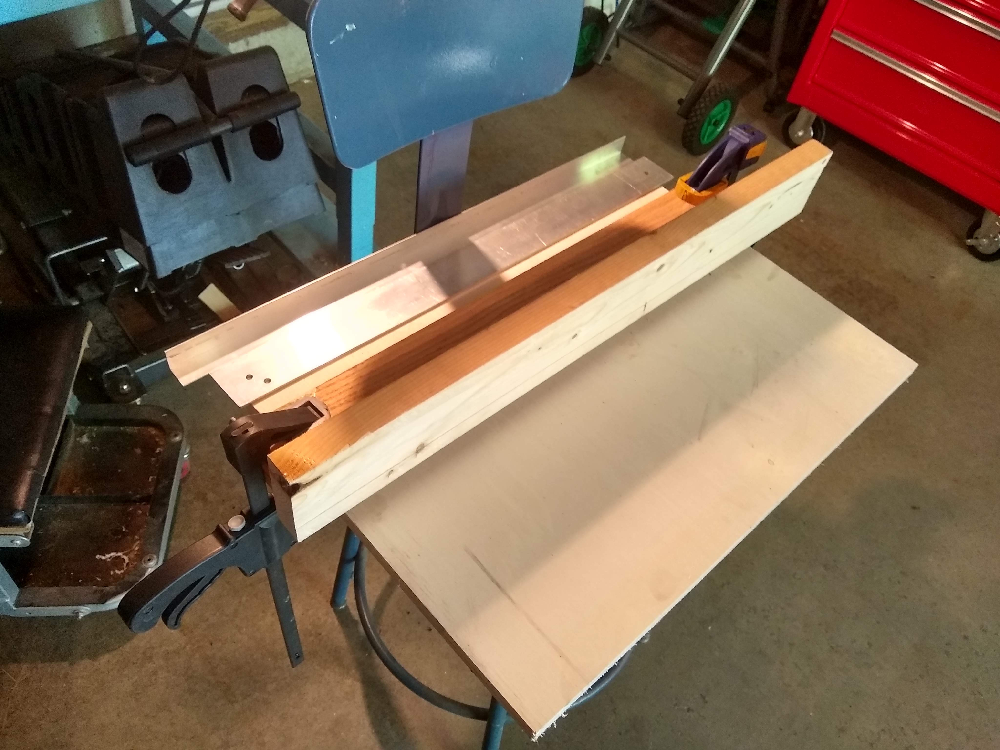
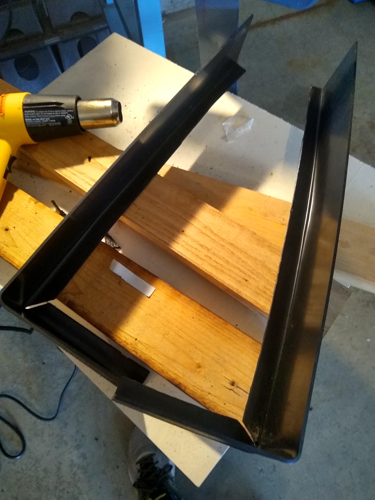
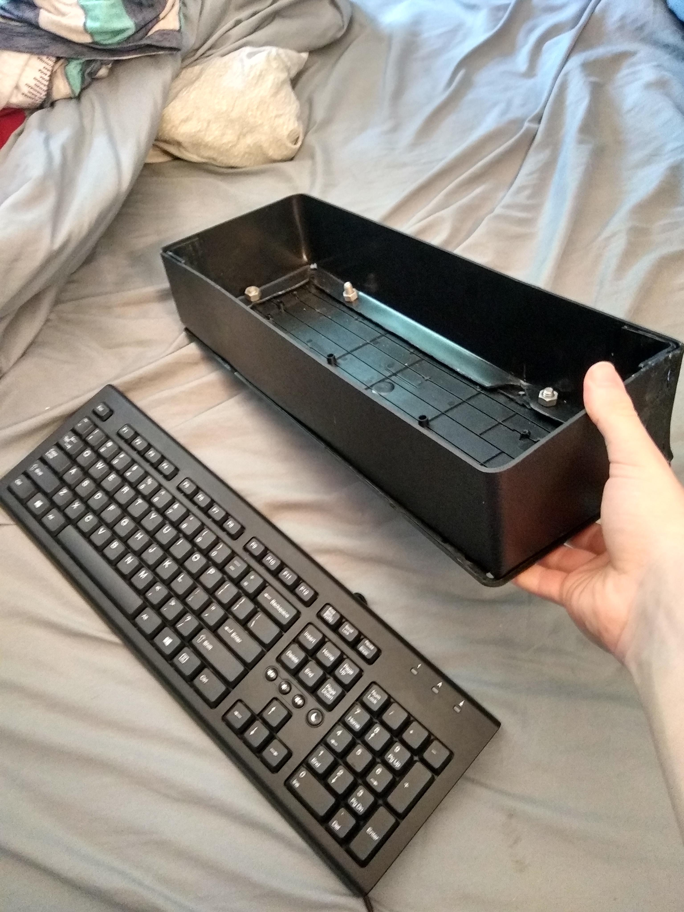
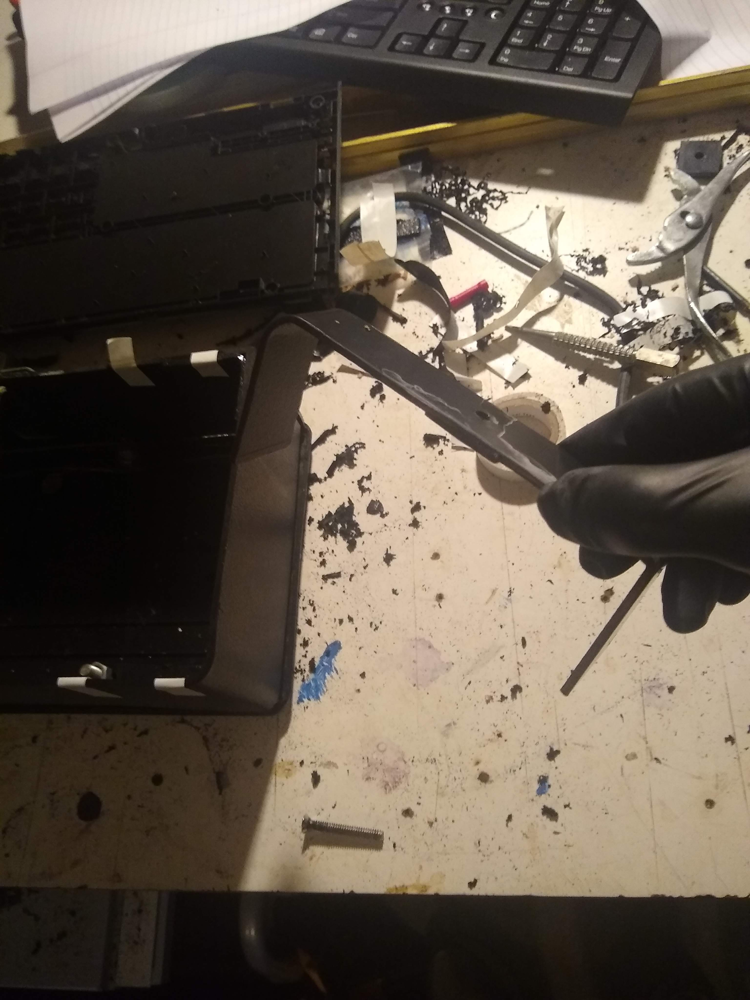
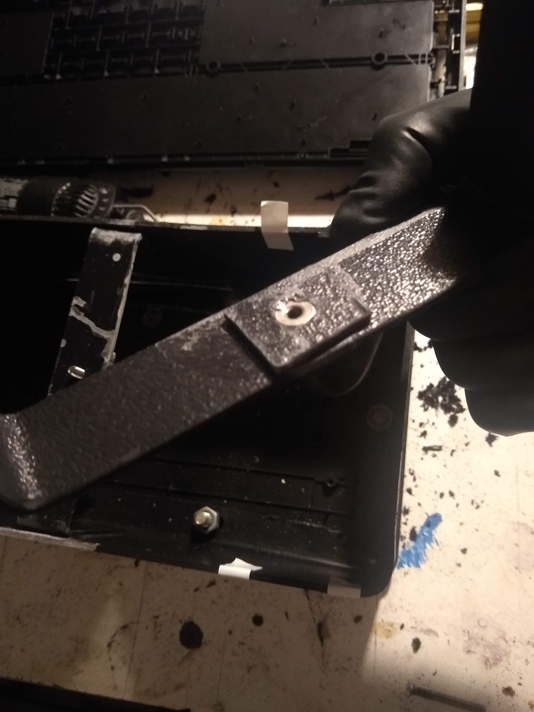
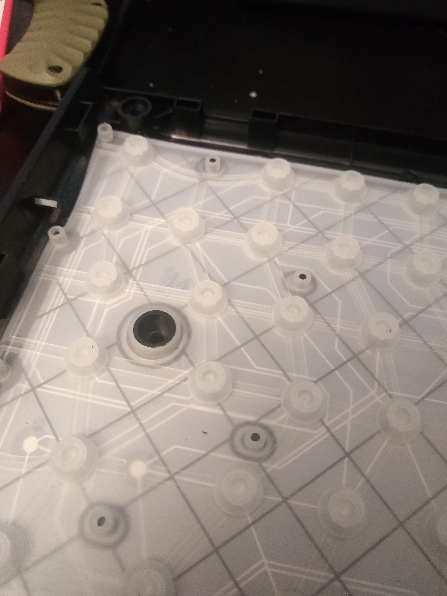
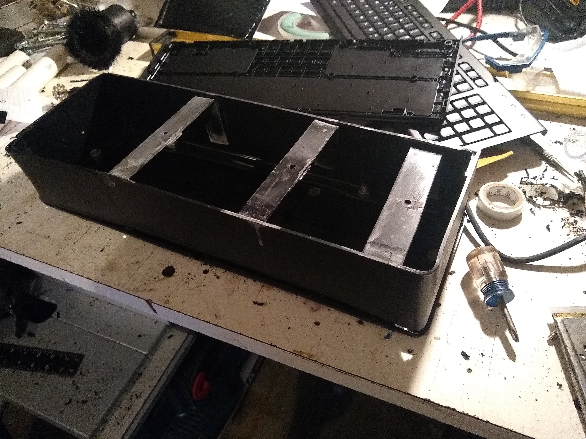

## Hardware

The following is a bill of materials for Lak (Some materials such as wire and solder I had previously)

| Item                                      | Use                                                     | Source                                                       | Price      |
| ----------------------------------------- | ------------------------------------------------------- | ------------------------------------------------------------ | ---------- |
| Raspberry Pi 4B                           | Powering Keyboard                                       | [Amazon](https://www.amazon.com/gp/product/B07TD42S27/)      | $45.25     |
| Raspberry Pi 4B Heatsync                  | Keeping Pi cool                                         | [Amazon](https://www.amazon.com/gp/product/B07ZLZRDXZ)       | $5.79      |
| Headphone Mic Splitter                    | Allow for integrated microphone                         | [Amazon](https://www.amazon.com/gp/product/B083FNN7LH)       | $3.99      |
| NVMe to USB 3.0 Adapter                   | Use NVMe drive with Raspberry Pi                        | [Amazon](https://www.amazon.com/gp/product/B07K6GPXDV/)      | $20.99     |
| 500GB NVMe Drive                          | Fast storage                                            | [Amazon](https://www.amazon.com/dp/B07XBX5SNN) (I got mine from a laptop drive upgrade) | $89.00     |
| Wired HP Keyboard                         | Typing/Keyboard bottom                                  | [HP Website](https://store.hp.com/us/en/pdp/hp-classic-wired-keyboard) | $14.99 x 2 |
| .118" x 12" x 24" ABS Plastic Sheet       | Keyboard body                                           | Local plastics supplier, I used [Piedmont Plastics](https://www.piedmontplastics.com/) | $15.00 x 2 |
| Assorted Latching Illuminated Pushbuttons | Side buttons                                            | [Adafruit](https://www.adafruit.com/product/1443)            | $1.50 x 3  |
| 24 Gauge wire (4 Pair) ~3' total          | Button wires                                            | [Amazon](https://www.amazon.com/Southwire-56917643-100-Feet-Outdoor-CMR-75-Degree/dp/B005V0BJ1S) (or anywhere else where wire can be bought) | $25.23     |
| Acetone                                   | Binding ABS Plastic                                     | [Home Depot](https://www.homedepot.com/p/100144922)          | $7.97      |
| 12mm Bolts                                | Bolting bottom to outer shell                           | [Home Depot](https://www.homedepot.com/p/204273548)          | $0.60 x 6  |
| 12mm Nuts                                 | Bolting bottom to outer shell                           | [Home Depot](https://www.homedepot.com/p/204274085)          | $0.36 x 6  |
| 4mm Bolts                                 | Securing top keyboard to shell                          | [Hope Depot](https://www.homedepot.com/p/204852270)          | $0.24 x 3  |
| 4mm Nuts                                  | Securing top keyboard to shell (embedded into supports) | [Hope Depot](https://www.homedepot.com/p/204836103)          | $0.23 x 3  |

Estimated cost for everything new:

**$269.87**

Tools required:

- Soldering Iron
- Band saw (Suggested)
- Dremel (or alternative)
- Drill
- Heat gun
- Clamps/Vice

I will be creating a (hopefully) short build tutorial shortly, along with pictures of the finished project and it in construction.

For now, here are some random pictures of its creation

 
 
 
 
 
 
 
 
